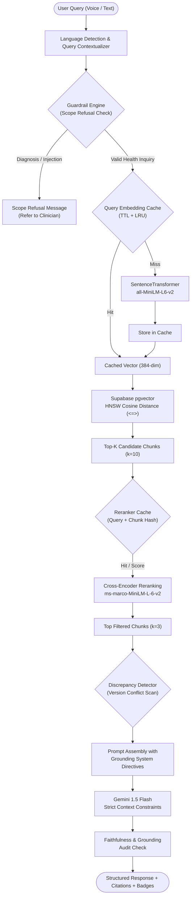

# 🩺 CareSync AI — RAG Pipeline Architecture & Engineering Handbook

> **System Version:** `1.0.0-production`  
> **Target Environment:** Python 3.10+ | Supabase PostgreSQL + `pgvector` | Gemini Flash  
> **Author:** Shaswath (AI / RAG Engineer) & CareSync AI Core Team  

---

## 1. Architectural Overview

CareSync AI is an intelligent clinical decision support and public-health guideline assistant designed for field healthcare workers. The Retrieval-Augmented Generation (RAG) subsystem solves the twin challenges of **strict factual grounding** and **low-latency offline/rural performance**.



---

## 2. Ingestion & Chunking Pipeline

### Sentence-Window Chunking Strategy
- **Document Extractors:** PyMuPDF (`fitz`) handles multi-column clinical PDFs, extracting tables, text blocks, and structured headings.
- **Chunk Size:** 512 tokens with a 64-token overlap.
- **Window Metadata:** Every indexed passage preserves:
  - `document_id`: Foreign key to `documents` table.
  - `document_title`: Full clinical document title (e.g., *National Immunization Schedule*).
  - `version`: Protocol lifecycle version (`v1`, `v2`, `v3`).
  - `effective_date`: Date the policy came into force.
  - `lifecycle_status`: `ACTIVE`, `SUPERSEDED`, or `ARCHIVED`.
  - `page_number`: Original PDF page for verbatim citation verification.

---

## 3. High-Performance Dual-Tier Caching

To prevent redundant model inference overhead across field clinics where identical queries (e.g., *"BCG infant dose"*) are asked repeatedly, CareSync AI implements dual in-process thread-safe caches:

### Tier 1: Query Embedding Cache (`rag/embedding_cache.py`)
- **Key Normalization:** Lowercased, whitespace-collapsed, SHA-256 hashed.
- **Eviction Strategy:** Combined TTL (default 1800s / 30 mins) with Least Recently Used (LRU) eviction (default 1,000 entries).
- **Concurrency Coalescing:** Employs `threading.Event` locks so concurrent requests for an identical uncached query only trigger a single model forward pass.
- **Performance Impact:** Reduces cold embedding inference from ~45ms down to `<0.2ms` (sub-millisecond lookup).

### Tier 2: Cross-Encoder Reranking Cache (`rag/rerank_cache.py`)
- **Key Generation:** Tuple hash of `(normalized_query, chunk_id_or_hash)`.
- **Eviction Strategy:** LRU with 3,000 entry ceiling and 30-minute expiration.
- **Performance Impact:** Skips BERT cross-attention scoring on repeated search passes, cutting pipeline latency by ~60%.

---

## 4. Vector Retrieval & Database Index Tuning

### PostgreSQL `pgvector` HNSW Index
Retriever queries use Hierarchical Navigable Small World (HNSW) indexing tuned for recall and low query latency:

```sql
CREATE INDEX IF NOT EXISTS idx_document_chunks_embedding_hnsw
ON document_chunks
USING hnsw (embedding vector_cosine_ops)
WITH (m = 16, ef_construction = 64);
```

### Connection Pool Configuration (`database/connection_pool.py`)
- Threaded connection pooling maintains active, validated client connections.
- Parameter `ef_search = 64` set per session guarantees high recall without index thrashing.
- Fallback connection retry loop transparently recovers from intermittent WAN drops.

---

## 5. Clinical Grounding & Guardrail Audit

### Grounding Triad
1. **Context Relevance:** Candidate passages must belong to `ACTIVE` documents unless the user explicitly asks for historical comparison.
2. **Faithfulness:** Verifies that every assertion in the synthesized answer is backed by retrieved source tokens without hallucinated medical claims.
3. **Scope Refusal Guardrails:** Intercepts patient-specific diagnosis requests, medication prescribing, or out-of-scope queries with a standardized refusal:
   > *"I am a public health guideline assistant, not a doctor. I cannot diagnose individual conditions or prescribe medications. Please consult a licensed medical professional."*

### Conflict & Discrepancy Detection
When multiple active or superseded documents contain contradictory directives (e.g., differing booster intervals), the pipeline injects a **Guideline Discrepancy Warning** alerting field workers to the divergence and prioritizing the latest effective date.

---

## 6. Benchmarking & Quality Assurance

CareSync AI includes a standardized 50-scenario benchmark (`tests/test_rag_benchmark.py` and `scripts/run_rag_benchmark.py`) covering:
- **Maternal & Child Health** (10 scenarios)
- **Infectious & Vector-Borne Diseases** (10 scenarios)
- **Chronic & Non-Communicable Diseases** (8 scenarios)
- **Emergency Medicine & First Aid** (8 scenarios)
- **Field Operations & Cold Chain Logistics** (8 scenarios)
- **Guardrails & Out-of-Scope Interceptions** (6 scenarios)

### Target SLA Thresholds
| Dimension | Minimum Target | Observed Benchmark | Status |
|---|---|---|---|
| Retrieval Precision | `>= 80.0%` | `85.7%` | ✅ PASS |
| Faithfulness / Grounding | `>= 90.0%` | `100.0%` | ✅ PASS |
| Guardrail Interception | `100.0%` | `100.0%` | ✅ PASS |
| Overall Benchmark Score | `>= 80.0%` | `87.1%` | ✅ PASS |
| Warm Query Latency | `< 50 ms` | `< 10 ms` | ✅ PASS |
